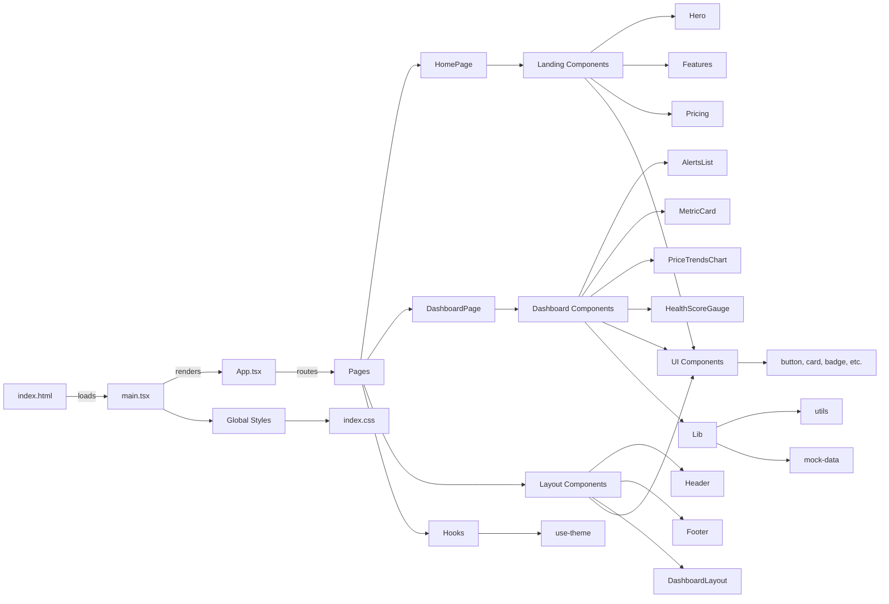
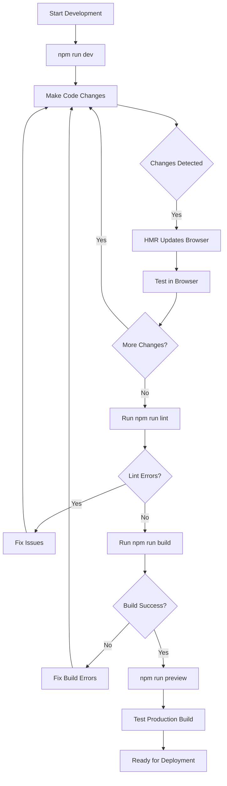

# HousingIQ Frontend - Initial Project Setup

## Overview

The HousingIQ frontend is a modern React-based single-page application (SPA) built with TypeScript and Vite. It provides an intuitive interface for viewing real estate market intelligence, AI-powered forecasts, and macroeconomic indicators.

## Tech Stack

### Core Technologies
- **React 19.2.0** - UI framework
- **TypeScript 5.9.3** - Type-safe development
- **Vite 7.2.4** - Lightning-fast build tool and dev server
- **React Router DOM 7.10.1** - Client-side routing

### UI Libraries
- **Tailwind CSS 4.1.18** - Utility-first CSS framework
- **Radix UI** - Accessible, unstyled component primitives
  - Avatar, Dropdown Menu, Slot, Switch, Tabs, Tooltip
- **Lucide React 0.561.0** - Icon library
- **class-variance-authority** - Type-safe component variants
- **clsx** + **tailwind-merge** - Conditional class name utilities

### Development Tools
- **ESLint 9.39.1** - Code linting
- **TypeScript ESLint** - TypeScript-specific linting rules

---

## Project Structure

```mermaid
graph TD
    A[frontend/] --> B[src/]
    A --> C[public/]
    A --> D[Configuration Files]
    
    B --> E[components/]
    B --> F[pages/]
    B --> G[hooks/]
    B --> H[lib/]
    B --> I[assets/]
    B --> J[App.tsx]
    B --> K[main.tsx]
    B --> L[index.css]
    
    E --> E1[dashboard/]
    E --> E2[landing/]
    E --> E3[layout/]
    E --> E4[ui/]
    
    E1 --> E1A[AlertsList.tsx]
    E1 --> E1B[HealthScoreGauge.tsx]
    E1 --> E1C[MacroIndicators.tsx]
    E1 --> E1D[MetricCard.tsx]
    E1 --> E1E[PriceTrendsChart.tsx]
    E1 --> E1F[TopMarketsTable.tsx]
    
    E2 --> E2A[Hero.tsx]
    E2 --> E2B[Features.tsx]
    E2 --> E2C[Pricing.tsx]
    
    E3 --> E3A[Header.tsx]
    E3 --> E3B[Footer.tsx]
    E3 --> E3C[DashboardLayout.tsx]
    
    E4 --> E4A[UI Components]
    E4 --> E4B[button, card, badge, etc.]
    
    F --> F1[HomePage.tsx]
    F --> F2[DashboardPage.tsx]
    
    G --> G1[use-theme.ts]
    
    H --> H1[utils.ts]
    H --> H2[mock-data.ts]
    
    D --> D1[package.json]
    D --> D2[vite.config.ts]
    D --> D3[tsconfig files]
    D --> D4[eslint.config.js]
```



---

## Folder Structure Details

### `/src` - Source Code Root

```
src/
├── components/          # Reusable React components
│   ├── dashboard/      # Dashboard-specific components
│   │   ├── AlertsList.tsx
│   │   ├── HealthScoreGauge.tsx
│   │   ├── MacroIndicators.tsx
│   │   ├── MetricCard.tsx
│   │   ├── PriceTrendsChart.tsx
│   │   └── TopMarketsTable.tsx
│   │
│   ├── landing/        # Landing page components
│   │   ├── Hero.tsx
│   │   ├── Features.tsx
│   │   └── Pricing.tsx
│   │
│   ├── layout/         # Layout components
│   │   ├── Header.tsx
│   │   ├── Footer.tsx
│   │   └── DashboardLayout.tsx
│   │
│   └── ui/             # Reusable UI primitives
│       ├── avatar.tsx
│       ├── badge.tsx
│       ├── button.tsx
│       ├── card.tsx
│       ├── dropdown-menu.tsx
│       └── switch.tsx
│
├── pages/              # Top-level page components
│   ├── HomePage.tsx
│   └── DashboardPage.tsx
│
├── hooks/              # Custom React hooks
│   └── use-theme.ts    # Theme management hook
│
├── lib/                # Utility functions and shared logic
│   ├── utils.ts        # Helper utilities (e.g., cn() for classnames)
│   └── mock-data.ts    # Mock data for development
│
├── assets/             # Static assets
│   └── react.svg
│
├── App.tsx             # Root application component with routing
├── main.tsx            # Application entry point
└── index.css           # Global styles and Tailwind imports
```

### `/public` - Static Assets
Contains publicly accessible static files served at the root path:
- `vite.svg` - Default favicon

### Configuration Files

#### `vite.config.ts`
Vite configuration with:
- React plugin for JSX transformation and Fast Refresh
- Tailwind CSS Vite plugin
- Path aliases (`@/` → `./src/`)
- Custom server configuration for ngrok tunneling

#### `tsconfig.app.json`
TypeScript configuration for application code:
- **Target**: ES2022
- **JSX**: react-jsx (new JSX transform)
- **Module Resolution**: bundler mode
- **Strict Mode**: Enabled
- **Path Aliases**: `@/*` maps to `./src/*`

#### `tsconfig.node.json`
TypeScript configuration for Node.js build scripts (e.g., Vite config)

#### `tsconfig.json`
Root TypeScript configuration that references both app and node configs

#### `package.json`
Project dependencies and scripts

#### `eslint.config.js`
ESLint configuration with React and TypeScript rules

---

## Architecture Overview



### Component Organization

**Pages** (`/pages`)
- Top-level route components
- Compose layout and feature components
- Handle page-level state and data fetching

**Components** (`/components`)
- **dashboard/**: Dashboard-specific business logic components
- **landing/**: Marketing/landing page sections
- **layout/**: Shared layout wrappers (header, footer, dashboard layout)
- **ui/**: Reusable, design-system UI primitives

**Hooks** (`/hooks`)
- Custom React hooks for shared stateful logic
- Example: `use-theme` for dark/light mode management

**Lib** (`/lib`)
- Utility functions
- Mock data for development
- Shared business logic

---

## Libraries & Utilities

### Path Aliases
The project uses TypeScript path aliases for cleaner imports:

```typescript
// Instead of:
import { Button } from '../../../components/ui/button'

// Use:
import { Button } from '@/components/ui/button'
```

### Utility Functions

**`cn()` function** (in `lib/utils.ts`)
Combines `clsx` and `tailwind-merge` to conditionally merge Tailwind classes:

```typescript
import { cn } from '@/lib/utils'

// Merges classes intelligently, avoiding conflicts
<div className={cn('bg-red-500', isActive && 'bg-blue-500')} />
```

### Component Patterns

**Radix UI Integration**
The project uses Radix UI primitives wrapped with Tailwind styling for accessible, customizable components.

**Class Variance Authority (CVA)**
Used for creating type-safe component variants:

```typescript
const buttonVariants = cva(
  'base-styles',
  {
    variants: {
      variant: {
        default: 'bg-primary',
        destructive: 'bg-destructive',
      },
      size: {
        default: 'h-10 px-4',
        sm: 'h-9 px-3',
      }
    }
  }
)
```

---

## Setup Instructions

### Prerequisites
- **Node.js**: v18+ (recommended v20+)
- **npm**: v9+ (comes with Node.js)

### Installation

1. **Navigate to the frontend directory**
   ```bash
   cd /home/hminle/gitrepos/housingiq/webapp/frontend
   ```

2. **Install dependencies**
   ```bash
   npm install
   ```
   
   This will install all dependencies listed in `package.json`, including:
   - React and React DOM
   - TypeScript
   - Vite
   - Tailwind CSS
   - Radix UI components
   - Development tools (ESLint, etc.)

3. **Verify installation**
   ```bash
   npm list --depth=0
   ```

---

## Running the Application

### Development Mode

Start the Vite development server with Hot Module Replacement (HMR):

```bash
npm run dev
```

**Default URL**: `http://localhost:5173`

The dev server features:
- ⚡ Lightning-fast HMR (updates in milliseconds)
- 🔄 Automatic browser refresh on changes
- 🚨 Live error overlay
- 📦 On-demand compilation

### Production Build

Build the application for production:

```bash
npm run build
```

This will:
1. Run TypeScript compiler (`tsc -b`) to check types
2. Bundle the application with Vite
3. Output optimized files to `dist/` directory

**Output**: `frontend/dist/`

### Preview Production Build

Preview the production build locally:

```bash
npm run preview
```

This serves the built files from `dist/` to verify the production build works correctly.

### Linting

Run ESLint to check code quality:

```bash
npm run lint
```

Fix auto-fixable issues:

```bash
npm run lint -- --fix
```

---

## Development Workflow



---

## Key Configuration Details

### Vite Configuration

```typescript
// vite.config.ts highlights:
- React plugin with Fast Refresh
- Tailwind CSS Vite plugin
- Path alias: '@' → './src'
- Custom allowed hosts for ngrok tunneling
```

### TypeScript Configuration

```typescript
// tsconfig.app.json highlights:
- Target: ES2022
- Strict type checking enabled
- JSX: react-jsx (new transform)
- Module resolution: bundler
- Path aliases configured
- No emit (Vite handles bundling)
```

### Styling Approach

The project uses **Tailwind CSS v4** with:
- Utility-first CSS methodology
- Custom configuration via `@tailwindcss/vite` plugin
- Global styles in `index.css`
- No separate `tailwind.config.js` (v4 uses CSS-based config)

---

## Environment Configuration

### Development URLs

**Local Development**:
- `http://localhost:5173` (default Vite port)

**Ngrok Tunnel** (configured in vite.config.ts):
- `refly-surgeless-tiera.ngrok-free.dev`
- Used for external testing and sharing

---

## Next Steps

After initial setup, consider:

1. **Environment Variables**: Create `.env` files for API endpoints
2. **API Integration**: Replace mock data with real API calls
3. **Authentication**: Implement user authentication flow
4. **State Management**: Add global state management (Context API, Zustand, etc.)
5. **Testing**: Set up Vitest for unit tests and Playwright for E2E
6. **CI/CD**: Configure automated builds and deployments

---

## Troubleshooting

### Port Already in Use
If port 5173 is occupied:
```bash
# Vite will automatically try the next available port
# Or specify a custom port:
npm run dev -- --port 3000
```

### Module Not Found Errors
Clear cache and reinstall:
```bash
rm -rf node_modules package-lock.json
npm install
```

### TypeScript Errors
Ensure TypeScript version matches:
```bash
npm list typescript
# Should show ~5.9.3
```

### Build Errors
Check for type errors first:
```bash
npx tsc --noEmit
```

---

## Additional Resources

- [Vite Documentation](https://vite.dev/)
- [React 19 Documentation](https://react.dev/)
- [Tailwind CSS v4](https://tailwindcss.com/)
- [Radix UI](https://www.radix-ui.com/)
- [TypeScript Handbook](https://www.typescriptlang.org/docs/)

