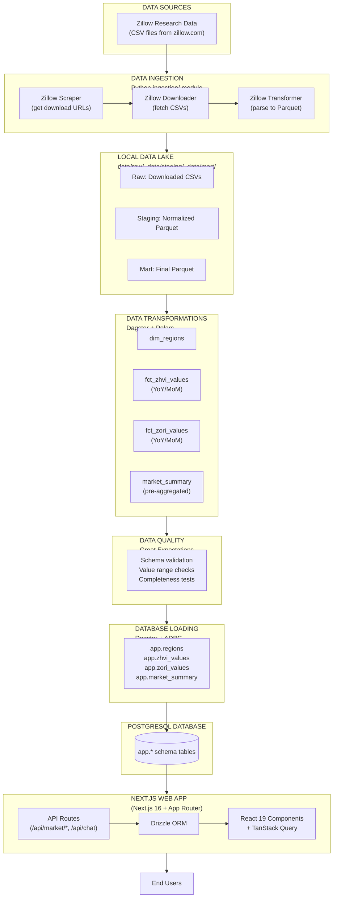

# Overview

## Introduction

**HousingIQ** is a modern housing market analytics platform that provides real-time insights into home values, rent prices, and market trends across the United States. Built with a production-grade data engineering stack and a fast, responsive web interface, HousingIQ demonstrates best practices in modern full-stack development and data pipeline architecture.

## Project Goals

1. **Real-Time Market Analytics**: Provide up-to-date housing market data for informed decision-making
2. **Data Engineering Excellence**: Showcase modern ELT patterns with Dagster, Polars, and PostgreSQL
3. **User-Friendly Interface**: Deliver an intuitive, fast, and beautiful web experience
4. **AI-Powered Insights**: Integrate multi-model AI chat for conversational housing analytics
5. **Scalable Architecture**: Build with patterns that support growth from states to ZIP codes

## Key Features

### For End Users

- **Market Overview Dashboard**: View median home prices, rent values, and trends at a glance with live platform stats
- **Interactive Charts**: Visualize ZHVI (home values) and ZORI (rent) time series data with bedroom and property type breakdowns
- **Location Search**: Find and compare markets by state, metro, county, or city with typeahead search
- **Market Rankings**: Discover fastest-growing markets and best investment opportunities with sortable tables
- **ROI Calculator**: Calculate potential returns on real estate investments with detailed projections
- **US Choropleth Map**: Visualize state-level market data on an interactive color-coded map
- **Region Comparison**: Compare up to 4 markets side-by-side with trend overlays
- **AI Chat with Generative UI**: Ask questions about housing market trends using multiple AI models (GPT 5.2, Claude, Gemini) — responses include AI-generated interactive charts, metrics, and insights via ToolLoopAgent and json-renderer
- **Market Health Score**: Computed 0-100 score based on appreciation, rent growth, P/R ratio, and rent yield

### For Data Engineers

- **Modern Data Stack**: Dagster + Polars + PostgreSQL + Great Expectations
- **ELT Pipeline**: Extract from Zillow → Load to local Parquet → Transform with Polars → Load to PostgreSQL
- **Asset-Based Orchestration**: Software-defined assets with automatic lineage tracking
- **Data Quality Gates**: Validation with Great Expectations before loading
- **High Performance**: Polars for multi-threaded, zero-copy DataFrame operations
- **Star Schema**: Dimensional modeling with fact and dimension tables

## High-Level Architecture



## Technology Stack

### Data Platform

| Component | Technology | Purpose |
|-----------|------------|---------|
| **Orchestration** | Dagster 1.6+ | Software-defined assets, DAG management, lineage tracking |
| **Transformations** | Polars 0.20+ | High-performance DataFrame operations (replaces dbt/Spark) |
| **Data Quality** | Great Expectations 0.18+ | Automated data validation and testing |
| **Storage (Raw)** | Parquet Files | Columnar storage for processed data |
| **Storage (Serving)** | PostgreSQL 16 | OLTP database for webapp queries |
| **Database Connectivity** | ADBC + SQLAlchemy | Fast bulk loading with Apache Arrow |

### Web Application

| Component | Technology | Purpose |
|-----------|------------|---------|
| **Framework** | Next.js 16 (App Router) | React server components, API routes, SSR |
| **Language** | TypeScript 5+ | Type safety across frontend and backend |
| **UI Library** | React 19 | Server Components, hooks, concurrent features |
| **Styling** | Tailwind CSS 4 + shadcn/ui | Utility-first CSS + accessible components |
| **ORM** | Drizzle ORM | Type-safe database queries |
| **Authentication** | NextAuth.js v5 | Google OAuth + email/password |
| **Charts** | Recharts 3 | React chart library for data visualization |
| **Maps** | react-simple-maps | US choropleth map visualization |
| **State Management** | TanStack Query | Server state management with caching |
| **AI Integration** | Vercel AI SDK + @ai-sdk/gateway | Multi-model AI chat with ToolLoopAgent (GPT, Claude, Gemini) |
| **Generative UI** | @json-render/core, react, shadcn | AI-generated React component trees via JSONL specs |
| **Rate Limiting** | Upstash Redis + @upstash/ratelimit | Sliding window rate limiting for AI chat |

### Infrastructure

| Component | Technology | Purpose |
|-----------|------------|---------|
| **Database** | PostgreSQL 16 | Primary data store |
| **Containerization** | Docker Compose | Local development + full-stack deployment |
| **Database Browser** | pgweb | Web-based database UI |
| **Production DB** | Neon | Serverless PostgreSQL for production |
| **Deployment** | Vercel | Next.js hosting |

## Data Sources

Currently integrated:

### Zillow Research Data
- **ZHVI (Zillow Home Value Index)**: Monthly median home values
- **ZORI (Zillow Observed Rent Index)**: Monthly median rent values
- **Coverage**: National, State, Metro, County, City, and ZIP code levels
- **Update Frequency**: Monthly (published ~15th of each month)
- **Source**: https://www.zillow.com/research/data/

## Project Structure

```
housingiq-app/                    # Monorepo root
├── data-platform/                # Data engineering stack
│   ├── housingiq_dagster/       # Dagster assets & orchestration
│   │   ├── assets/
│   │   │   ├── zillow.py        # Ingestion assets
│   │   │   ├── transforms.py    # Polars transformations
│   │   │   └── database.py      # PostgreSQL loading
│   │   ├── definitions.py       # Dagster definitions
│   │   ├── resources.py         # Shared resources
│   │   ├── schedules.py         # Scheduled jobs
│   │   ├── sensors.py           # Event-driven triggers
│   │   ├── transforms_logic.py  # Business logic functions
│   │   ├── metadata.py          # Asset metadata helpers
│   │   └── paths.py             # Data layer paths (raw/staging/mart)
│   ├── ingestion/               # Data source connectors
│   │   └── sources/zillow/      # Zillow-specific code
│   ├── great_expectations/      # Data quality validation
│   ├── scripts/                 # Utility scripts (sync_to_neon.py)
│   ├── data/                    # Local data lake (gitignored)
│   │   ├── raw/                 # Downloaded CSVs
│   │   ├── staging/             # Normalized Parquet
│   │   └── mart/                # Final Parquet
│   ├── tests/                   # Python tests
│   ├── pyproject.toml           # Python dependencies
│   └── Makefile                 # Data platform commands
│
├── webapp/                       # Next.js full-stack web application
│   ├── src/
│   │   ├── app/                 # App Router pages & API routes
│   │   │   ├── api/
│   │   │   │   ├── auth/        # NextAuth.js + signup
│   │   │   │   ├── chat/        # AI chat + usage endpoints
│   │   │   │   ├── market/      # Market data API endpoints
│   │   │   │   └── regions/     # Region search
│   │   │   ├── dashboard/       # Dashboard pages
│   │   │   │   ├── page.tsx     # Main dashboard
│   │   │   │   ├── chat/        # AI chat page
│   │   │   │   ├── compare/     # Region comparison
│   │   │   │   ├── rankings/    # Market rankings
│   │   │   │   ├── calculator/  # Investment calculator
│   │   │   │   ├── map/         # US choropleth map
│   │   │   │   └── layout.tsx   # Sidebar layout
│   │   │   ├── login/           # Login page
│   │   │   ├── signup/          # Signup page
│   │   │   └── page.tsx         # Landing page
│   │   ├── components/          # React components
│   │   │   ├── ai-elements/     # AI chat UI primitives
│   │   │   ├── ui/              # shadcn/ui components
│   │   │   ├── LocationSearchBar.tsx
│   │   │   ├── MarketOverviewCard.tsx
│   │   │   ├── MarketHealthScore.tsx
│   │   │   ├── PriceTrendChart.tsx
│   │   │   ├── BedroomComparisonChart.tsx
│   │   │   ├── PropertyTypeAnalysis.tsx
│   │   │   ├── RegionComparePicker.tsx
│   │   │   └── Providers.tsx
│   │   └── lib/                 # Utilities, DB, Auth, AI
│   │       ├── ai/              # ToolLoopAgent, json-render catalog/registry, tools, providers
│   │       ├── db/              # Drizzle ORM
│   │       ├── auth/            # NextAuth.js config
│   │       └── hooks/           # TanStack Query hooks
│   ├── package.json             # Node.js dependencies
│   └── .env.local               # Webapp environment variables
│
├── docker-compose.yml           # Full-stack Docker Compose
├── init-db/                     # Database initialization
├── Makefile                     # Root orchestration commands
└── docs/                        # Documentation
```

## Development Workflow

### 1. First-Time Setup

```bash
# Start infrastructure (PostgreSQL + pgweb)
make up

# Install all dependencies and set up database
make setup

# This runs:
# - pip install -e ".[dev]" (data platform)
# - npm install (webapp)
# - npm run db:push (create database schema)
# - npm run db:seed-test-user (create test account)
```

### 2. Start Development

```bash
# Option A: Start all services together
make dev

# Option B: Start services individually
make webapp    # Next.js on localhost:3000
make dagster   # Dagster UI on localhost:3001
```

### 3. Run Data Pipeline

```bash
# Open Dagster UI at http://localhost:3001
# Click "Materialize all" to run the full pipeline

# Or use CLI:
make materialize
```

### 4. View Application

- **Webapp**: http://localhost:3000
- **Dagster UI**: http://localhost:3001
- **Database UI (pgweb)**: http://localhost:8081

## Key Differentiators

### Why Polars Instead of dbt/Spark?

1. **Performance**: 10-100x faster than Pandas, competes with Spark for many workloads
2. **Simplicity**: Pure Python, no JVM, no cluster management
3. **Memory Efficiency**: Lazy evaluation, streaming, zero-copy operations
4. **Developer Experience**: Better error messages, intuitive API
5. **Local Development**: Runs fast on a laptop, same code in production

### Why Dagster Instead of Airflow?

1. **Software-Defined Assets**: Model data as assets, not tasks
2. **Type System**: Strong typing with Python hints and Pydantic
3. **Development Experience**: Fast feedback loop, better testing
4. **Lineage**: Automatic data lineage tracking
5. **Modern Architecture**: Built for cloud-native, not bolted on

## Current Status

### Completed Features

- [x] Data ingestion from Zillow Research (ZHVI + ZORI)
- [x] Polars-based ETL pipeline with Dagster orchestration
- [x] PostgreSQL database with optimized schema
- [x] Next.js webapp with authentication (Google OAuth + email/password)
- [x] Market overview dashboard with live platform stats
- [x] Location search with typeahead (state, metro, county, city)
- [x] Price trend visualizations with filter controls
- [x] Bedroom comparison charts
- [x] Property type analysis (Single Family vs Condo)
- [x] Market Health Score (0-100 computed metric)
- [x] Market rankings with sortable tables
- [x] Region comparison (up to 4 regions side-by-side)
- [x] US choropleth map with state-level data
- [x] Investment ROI calculator
- [x] AI chat with ToolLoopAgent and generative UI (json-renderer)
- [x] Multi-model support for AI chat (GPT 5.2, Claude Haiku 4.5, Gemini 3 Flash, Claude 3.7 Sonnet)
- [x] Custom component catalog: Metric, LineChart, Callout with state binding
- [x] Rate limiting for AI chat (Upstash Redis)
- [x] Docker Compose for full-stack deployment
- [x] Production sync to Neon (serverless PostgreSQL)
- [x] Popular regions filter for Neon free tier optimization

### Planned Features

- [ ] ZIP code data (Pro tier feature)
- [ ] Additional data sources (Redfin, Census)
- [ ] Machine learning price predictions
- [ ] User portfolios and watchlists
- [ ] Export to CSV/PDF
- [ ] Email alerts for market changes

## Performance Characteristics

| Metric | Current Performance |
|--------|-------------------|
| Full pipeline runtime | ~5-10 minutes (State/Metro/County/City) |
| Dashboard page load | <500ms (server-side rendering) |
| API response time | <100ms (pre-aggregated data) |
| Chart rendering | <50ms (client-side) |
| Database size | ~167MB (popular regions, full history) |

## Getting Help

- **Setup Issues**: Check [07-setup-guide.md](./07-setup-guide.md)
- **Architecture**: See [02-architecture.md](./02-architecture.md)
- **Data Platform**: Read [09-data-platform.md](./09-data-platform.md)
- **API Reference**: See [08-api-reference.md](./08-api-reference.md)
- **AI Chat & Generative UI**: See [11-ai-chat.md](./11-ai-chat.md)

## Next Steps

To get started with development:
1. Follow the [Setup Guide](./07-setup-guide.md)
2. Read [Architecture](./02-architecture.md) to understand system design
3. Explore [Data Platform](./09-data-platform.md) for data engineering details
