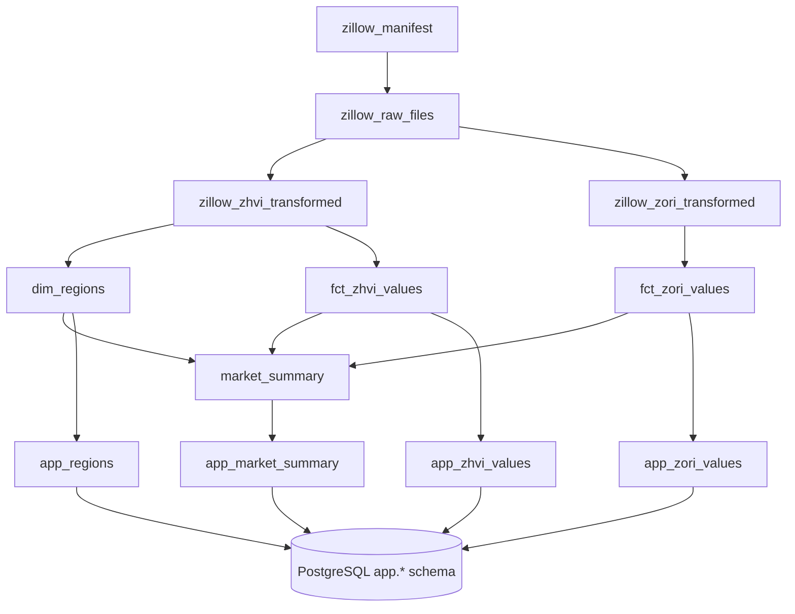
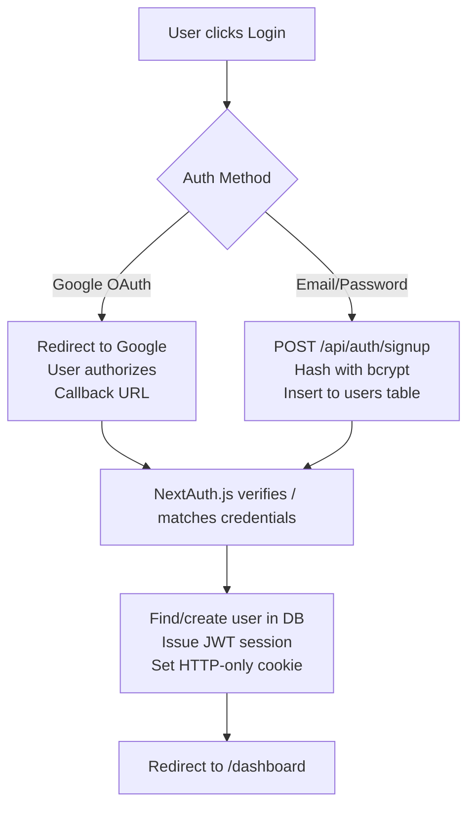
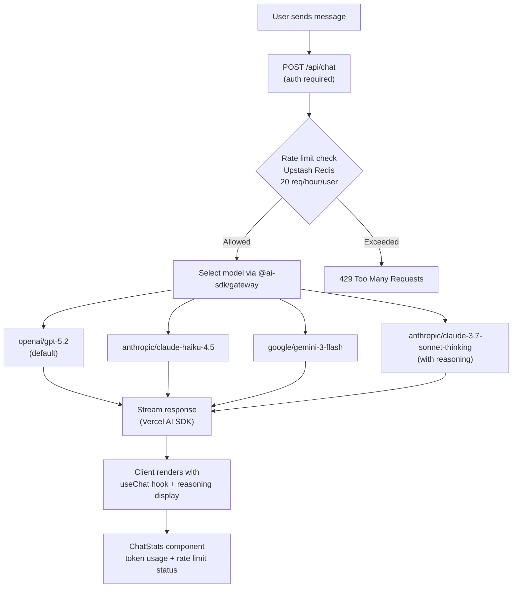

# System Architecture

## Table of Contents

1. [Full System Architecture](#full-system-architecture)
2. [Component Layers](#component-layers)
3. [Data Platform Architecture](#data-platform-architecture)
4. [Web Application Architecture](#web-application-architecture)
5. [Database Architecture](#database-architecture)
6. [Authentication Flow](#authentication-flow)
7. [AI Chat Architecture](#ai-chat-architecture)
8. [Data Flow](#data-flow)
9. [Deployment Architecture](#deployment-architecture)

---

## Full System Architecture

```mermaid
flowchart TD
    subgraph Sources["EXTERNAL DATA SOURCES"]
        ZILLOW["Zillow Research\nCSV Files"]
    end

    subgraph DataPlatform["DATA PLATFORM LAYER\n(Dagster + Polars + Great Expectations)"]
        direction TB
        DAGSTER["Dagster Orchestration\n(localhost:3001)\nSoftware-Defined Assets"]

        subgraph IngestionLayer["Ingestion Layer"]
            SCRAPE["1. Zillow Scraper\nDiscover CSV URLs"]
            DOWNLOAD["2. Zillow Downloader\nFetch CSVs to data/raw/"]
            TRANSFORM["3. Zillow Transformer\nParse CSVs to Parquet"]
            SCRAPE --> DOWNLOAD --> TRANSFORM
        end

        subgraph DataLake["Local Data Lake"]
            RAW["data/raw/\nDownloaded CSVs"]
            STAGING["data/staging/\nNormalized Parquet"]
            MART["data/mart/\nFinal Parquet"]
        end

        subgraph PolarsTransforms["Polars Transformations"]
            DIM["dim_regions\n(display names)"]
            FCT_Z["fct_zhvi_values\n(YoY/MoM)"]
            FCT_R["fct_zori_values\n(YoY/MoM)"]
            MKT["market_summary\n(pre-aggregated)"]
        end

        GX["Great Expectations\nSchema | Range | Completeness"]

        subgraph DBLoad["Database Loading (ADBC)"]
            LOAD["app.regions | app.zhvi_values\napp.zori_values | app.market_summary\nPopular Regions Filter applied"]
        end

        DAGSTER --> IngestionLayer
        IngestionLayer --> DataLake
        DataLake --> PolarsTransforms
        PolarsTransforms --> GX --> DBLoad
    end

    subgraph Database["DATABASE LAYER (PostgreSQL 16)"]
        subgraph AppSchema["app.* Schema (Serving)"]
            REGIONS[("regions")]
            ZHVI[("zhvi_values")]
            ZORI[("zori_values")]
            MKTSUMMARY[("market_summary")]
        end
        subgraph PubSchema["public Schema (Auth)"]
            USERS[("users")]
        end
    end

    subgraph WebApp["WEB APPLICATION LAYER (Next.js 16, localhost:3000)"]
        subgraph ServerLayer["Server Layer"]
            API["API Routes\n/api/market/* | /api/chat\n/api/regions/* | /api/auth/*"]
            ORM["Drizzle ORM\nType-safe schema"]
            AUTH["NextAuth.js v5\nGoogle OAuth + Credentials"]
            AI_LIB["AI Integration\n@ai-sdk/gateway + Upstash"]
        end

        subgraph ClientLayer["Client Layer (React 19)"]
            PAGES["Pages\n/ | /login | /dashboard\n/chat | /compare | /rankings\n/calculator | /map"]
            COMPONENTS["Components\nLocationSearchBar | MarketOverviewCard\nPriceTrendChart | MarketHealthScore\nai-elements/* | ui/*"]
            HOOKS["TanStack Query Hooks\nuseMarketStats | useMarketData\nuseTrendData | useRankings"]
        end
    end

    subgraph External["EXTERNAL SERVICES"]
        GOOGLE["Google OAuth 2.0\nAuthentication"]
        AI_GW["AI Gateway\nGPT | Claude | Gemini"]
        UPSTASH["Upstash Redis\nRate Limiting"]
    end

    ENDUSERS["End Users"]

    ZILLOW --> DataPlatform
    DBLoad --> Database
    Database --> ServerLayer
    ServerLayer --> ClientLayer
    WebApp --> ENDUSERS
    WebApp <--> External
```



---

## Component Layers

### 1. Data Platform Layer

**Purpose**: Extract, transform, and load housing market data

**Components**:
- **Dagster**: Orchestration and asset management
- **Python Ingestion**: Custom extractors for data sources
- **Polars**: High-performance DataFrame transformations
- **Great Expectations**: Data quality validation
- **Parquet**: Columnar storage for intermediate data

**Key Files**:
```
data-platform/
├── housingiq_dagster/
│   ├── assets/
│   │   ├── zillow.py        # Scraper, downloader, transformer
│   │   ├── transforms.py    # Polars transformations
│   │   └── database.py      # PostgreSQL loading
│   ├── definitions.py       # Dagster definitions
│   ├── transforms_logic.py  # Business logic (YoY/MoM, market classification)
│   ├── paths.py             # Data layer paths (RAW_DIR, STAGING_DIR, MART_DIR)
│   └── schedules.py         # Scheduled jobs
├── ingestion/sources/zillow/
│   ├── scraper.py          # Discover CSV URLs
│   ├── downloader.py       # Download CSVs
│   ├── transformer.py      # Parse CSV → Parquet
│   └── schemas.py          # Pydantic models
└── great_expectations/
    └── expectations/        # Validation suites
```

### 2. Database Layer

**Purpose**: Persistent storage for both serving data and auth

**Schema Design**:
- `app.*` schema: Serving layer (optimized for webapp queries)
- `public.*` schema: Authentication tables

**Connection**: PostgreSQL 16 via Docker Compose (local) or Neon (production)

### 3. Web Application Layer

**Purpose**: User interface, API, and AI integration

**Framework**: Next.js 16 with App Router
- **Server Components**: Default rendering mode
- **Client Components**: Interactive elements
- **API Routes**: Backend endpoints
- **TanStack Query**: Client-side data fetching with caching

**Key Patterns**:
- Server-side rendering (SSR) for SEO
- Client-side data fetching with TanStack Query for interactivity
- Streaming AI responses via Vercel AI SDK
- Type-safe database queries with Drizzle ORM

---

## Data Platform Architecture

### Asset Dependency Graph



### Transformation Pipeline (Polars)

**Why Polars?**
- 10-100x faster than Pandas
- Memory efficient (lazy evaluation)
- Multi-threaded by default
- Better error messages
- Same code runs on laptop and production

### Data Quality Gates

**Great Expectations** validates data before loading:
- Schema validation (column names, types)
- Value range checks (ZHVI values between $0-$10M)
- Completeness tests (no null region_ids)
- Row count thresholds

---

## Web Application Architecture

### Next.js 16 App Router

**Routing Structure**:
```
src/app/
├── page.tsx                   # Landing page (/)
├── login/page.tsx             # Login (/login)
├── signup/page.tsx            # Signup (/signup)
├── dashboard/
│   ├── layout.tsx             # Sidebar layout (protected)
│   ├── page.tsx               # Dashboard (/dashboard)
│   ├── chat/page.tsx          # AI Chat (/dashboard/chat)
│   ├── compare/page.tsx       # Compare (/dashboard/compare)
│   ├── rankings/page.tsx      # Rankings (/dashboard/rankings)
│   ├── calculator/page.tsx    # Calculator (/dashboard/calculator)
│   └── map/page.tsx           # Map (/dashboard/map)
└── api/
    ├── auth/
    │   ├── [...nextauth]/     # NextAuth.js catch-all
    │   └── signup/            # POST /api/auth/signup
    ├── chat/
    │   ├── route.ts           # POST /api/chat (streaming)
    │   └── usage/route.ts     # GET /api/chat/usage
    ├── market/
    │   ├── all/route.ts       # GET /api/market/all
    │   ├── [regionId]/
    │   │   ├── route.ts       # GET /api/market/:regionId
    │   │   ├── trends/route.ts    # GET trends
    │   │   ├── bedrooms/route.ts  # GET bedroom breakdown
    │   │   └── property-types/route.ts  # GET property types
    │   ├── compare/route.ts   # GET /api/market/compare
    │   ├── rankings/route.ts  # GET /api/market/rankings
    │   └── stats/route.ts     # GET /api/market/stats
    └── regions/
        └── search/route.ts    # GET /api/regions/search
```

### Server vs Client Components

**Server Components** (default):
- No JavaScript sent to client
- Direct database access
- Async/await for data fetching
- Use for: layouts, static pages, data fetching

**Client Components** (`'use client'`):
- Interactive elements (charts, search, forms)
- React hooks (useState, useEffect, useChat)
- TanStack Query for server state
- Use for: dashboard, charts, search bars, AI chat

---

## Database Architecture

### Schema Design

**Principle**: Keep it simple for the webapp. Complex transformations happen in Polars before loading.

#### `app.regions` (Dimension Table)

```sql
CREATE TABLE app.regions (
    region_id VARCHAR(100) PRIMARY KEY,
    region_name VARCHAR(255),
    display_name VARCHAR(500),        -- Formatted for UI
    geography_level VARCHAR(50),      -- 'State', 'Metro', 'County', 'City'
    state VARCHAR(2),                 -- State code (TX, CA, etc.)
    state_name VARCHAR(100),
    city VARCHAR(255),
    county VARCHAR(255),
    metro VARCHAR(255),
    size_rank INTEGER                 -- Population rank
);
```

#### `app.zhvi_values` (Fact Table - Home Values)

```sql
CREATE TABLE app.zhvi_values (
    region_id VARCHAR(100),
    date DATE,
    value REAL,                       -- Home value in USD
    geography_level VARCHAR(50),
    home_type VARCHAR(50),            -- 'All Homes', 'Single Family', etc.
    tier VARCHAR(50),                 -- 'Mid-Tier', 'Top-Tier', etc.
    bedrooms INTEGER,
    smoothed BOOLEAN,
    seasonally_adjusted BOOLEAN,
    frequency VARCHAR(20),
    mom_change_pct REAL,              -- Month-over-month change %
    yoy_change_pct REAL               -- Year-over-year change %
);
```

#### `app.market_summary` (Pre-Aggregated)

```sql
CREATE TABLE app.market_summary (
    region_id VARCHAR(100) PRIMARY KEY,
    region_name VARCHAR(255),
    display_name VARCHAR(500),
    geography_level VARCHAR(50),
    state_code VARCHAR(2),
    state_name VARCHAR(100),
    metro VARCHAR(255),
    size_rank INTEGER,
    current_home_value REAL,
    home_value_yoy_pct REAL,
    home_value_mom_pct REAL,
    home_value_date DATE,
    current_rent_value REAL,
    rent_yoy_pct REAL,
    rent_mom_pct REAL,
    rent_value_date DATE,
    price_to_rent_ratio REAL,
    gross_rent_yield_pct REAL,
    market_classification VARCHAR(20)  -- 'Hot', 'Warm', 'Cold'
);
```

#### `public.users` (Authentication)

```sql
CREATE TABLE users (
    id SERIAL PRIMARY KEY,
    email VARCHAR(255) NOT NULL UNIQUE,
    name VARCHAR(255),
    image TEXT,
    password_hash VARCHAR(255),       -- For email/password auth
    google_id VARCHAR(255) UNIQUE,    -- For Google OAuth
    created_at TIMESTAMP DEFAULT NOW(),
    updated_at TIMESTAMP DEFAULT NOW()
);
```

---

## Authentication Flow

### NextAuth.js v5

**Providers**:
1. **Google OAuth**: Primary method
2. **Credentials**: Email/password fallback

**Flow**:



**Protected Routes**: All `/dashboard/*` paths require authentication. The `authorized` callback in NextAuth config redirects unauthenticated users to `/login`.

---

## AI Chat Architecture

### Multi-Model Support

The AI chat feature uses `@ai-sdk/gateway` to route requests to multiple AI providers:



**Key Components**:
- `src/lib/ai/providers.ts` - Model configuration and middleware (reasoning extraction)
- `src/lib/ai/ratelimit.ts` - Upstash sliding window rate limiter
- `src/app/api/chat/route.ts` - Streaming chat endpoint
- `src/app/api/chat/usage/route.ts` - Rate limit status endpoint
- `src/components/ai-elements/chat-stats.tsx` - Token usage and rate limit display

---

## Data Flow

### End-to-End Data Flow

**1. Data Ingestion** (Monthly):
```
Zillow publishes new CSV → Dagster schedule triggers → Scraper finds URLs
→ Downloader fetches CSVs to data/raw/ → Transformer parses to Parquet (data/staging/)
```

**2. Data Transformation** (After ingestion):
```
Polars reads staging Parquet → Window functions calculate YoY/MoM
→ Writes mart Parquet → Great Expectations validates → Passes → Continue
```

**3. Database Loading**:
```
Polars reads mart Parquet → Popular regions filter applied
→ ADBC bulk insert to PostgreSQL → app.regions, app.zhvi_values, app.market_summary
```

**4. Web Application Query** (Real-time):
```
User visits /dashboard → TanStack Query fetches /api/market/stats
→ Drizzle ORM queries PostgreSQL → Returns typed data
→ React renders live platform stats + market overview
```

**5. Interactive User Action**:
```
User types "Austin" in search → Client Component debounces input (300ms)
→ Fetch /api/regions/search?q=Austin → Drizzle queries app.regions
→ Returns matches → React updates autocomplete dropdown
```

**6. AI Chat Interaction**:
```
User sends message → POST /api/chat with model selection
→ Rate limit check (Upstash) → Stream from AI Gateway
→ Client renders streaming response with useChat hook
→ ChatStats updates token count and remaining requests
```

---

## Deployment Architecture

### Local Development

**Services**:
- PostgreSQL: `localhost:5432` (Docker)
- pgweb: `localhost:8081` (Docker)
- Next.js: `localhost:3000`
- Dagster: `localhost:3001`

**Start Command**:
```bash
make dev  # Starts all services
```

### Docker Compose (Full Stack)

**Services**:
| Service | Image | Port | Purpose |
|---------|-------|------|---------|
| postgres | postgres:16-alpine | 5432 | PostgreSQL database |
| pgweb | sosedoff/pgweb | 8081 | Web database UI |
| webapp | custom (Next.js) | 3000 | Next.js frontend |
| dagster-webserver | custom | 3001 | Dagster UI |
| dagster-daemon | custom | - | Scheduler/sensor daemon |
| webapp-init | custom (init) | - | One-shot schema push + seed |

### Production

**Current Stack**:
- **Database**: Neon (serverless PostgreSQL)
- **Webapp**: Vercel (Next.js native support)
- **AI Services**: AI SDK Gateway (routes to OpenAI, Anthropic, Google)
- **Rate Limiting**: Upstash Redis (serverless)

**Sync to Production**:
```bash
make sync-to-neon  # Syncs app.* tables from local to Neon
```

---

## Performance Characteristics

| Layer | Metric | Performance |
|-------|--------|-------------|
| **Data Ingestion** | Full Zillow download | ~2-5 minutes |
| **Polars Transforms** | 1M rows YoY calculation | ~500ms |
| **Database Load** | Bulk insert 1M rows | ~5 seconds (ADBC) |
| **API Response** | Market summary query | <50ms |
| **Page Load** | Dashboard SSR | <300ms (cold) |
| **Chart Render** | 100 data points | <50ms |
| **AI Chat** | First token latency | ~500ms-2s (model dependent) |

---

## Technology Decisions

### Why Polars Instead of dbt?

| Factor | dbt | Polars |
|--------|-----|--------|
| **Speed** | SQL engine dependent | 10-100x faster than Pandas |
| **Memory** | Loads full dataset | Lazy evaluation, streaming |
| **Development** | SQL + Jinja | Pure Python, better IDE support |
| **Complexity** | Requires warehouse | Runs anywhere Python runs |
| **Testing** | dbt test | pytest with actual data |

### Why Dagster Instead of Airflow?

| Factor | Airflow | Dagster |
|--------|---------|---------|
| **Paradigm** | Tasks (imperative) | Assets (declarative) |
| **Type Safety** | Weak | Strong (Pydantic) |
| **Testing** | Complex | Unit test assets directly |
| **Lineage** | Manual | Automatic |
| **Local Dev** | Heavy (Docker) | Lightweight (pip install) |

### Why Next.js Instead of Separate Frontend/Backend?

| Factor | Separate | Next.js |
|--------|----------|---------|
| **Complexity** | 2 repos, 2 deploys | Single repo |
| **Type Safety** | Manual API contract | Shared types |
| **Performance** | Client-side rendering | SSR + RSC |
| **API Routes** | Separate Express/FastAPI | Co-located with pages |
| **AI Streaming** | Custom setup | Built-in with Vercel AI SDK |

---

## Next Steps

To dive deeper into specific components:
- **Data Platform**: [09-data-platform.md](./09-data-platform.md)
- **Database Schema**: [03-database-schema.md](./03-database-schema.md)
- **Frontend**: [05-frontend.md](./05-frontend.md)
- **Authentication**: [04-authentication.md](./04-authentication.md)
- **API Reference**: [08-api-reference.md](./08-api-reference.md)
