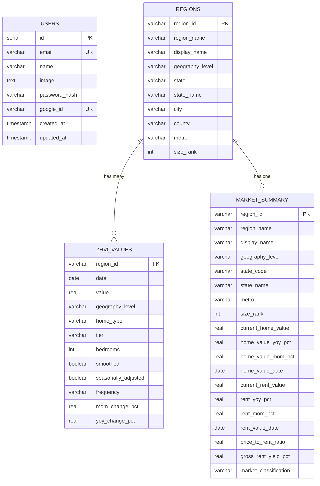

# Database Schema

## Overview

The database uses PostgreSQL 16 with Drizzle ORM for type-safe queries. The schema is split across two schemas:
- **`app.*`** - Housing data tables (populated by Dagster/Polars pipeline)
- **`public.*`** - Authentication tables (managed by Drizzle ORM)

## Entity Relationship Diagram



## Tables

### users (`public.users`)

Stores authenticated users from Google OAuth and email/password authentication.

| Column | Type | Constraints | Description |
|--------|------|-------------|-------------|
| id | serial | PRIMARY KEY | Auto-increment ID |
| email | varchar(255) | UNIQUE, NOT NULL | User email |
| name | varchar(255) | - | Display name |
| image | text | - | Profile picture URL |
| password_hash | varchar(255) | - | Bcrypt hash for email/password auth |
| google_id | varchar(255) | UNIQUE | Google account ID |
| created_at | timestamp | NOT NULL, DEFAULT now() | Registration time |
| updated_at | timestamp | NOT NULL, DEFAULT now() | Last update time |

### regions (`app.regions`)

Dimension table containing geographic region metadata. Populated by the Dagster pipeline.

| Column | Type | Constraints | Description |
|--------|------|-------------|-------------|
| region_id | varchar(100) | PRIMARY KEY | Unique region identifier (e.g., `state_ca`, `metro_10580`) |
| region_name | varchar(255) | NOT NULL | Region name |
| display_name | varchar(500) | - | Formatted human-readable name for UI |
| geography_level | varchar(50) | NOT NULL | National/State/Metro/County/City |
| state | varchar(2) | - | State abbreviation |
| state_name | varchar(100) | - | Full state name |
| city | varchar(255) | - | City name |
| county | varchar(255) | - | County name |
| metro | varchar(255) | - | Metropolitan area |
| size_rank | integer | - | Population-based ranking |

### zhvi_values (`app.zhvi_values`)

Fact table containing Zillow Home Value Index time series data with pre-computed change metrics.

| Column | Type | Constraints | Description |
|--------|------|-------------|-------------|
| region_id | varchar(100) | NOT NULL | Foreign key to regions |
| date | date | NOT NULL | Observation date |
| value | real | - | ZHVI value in dollars |
| geography_level | varchar(50) | NOT NULL | State/County/Metro/City |
| home_type | varchar(50) | NOT NULL | All Homes/Single Family/Condo/Multi Family |
| tier | varchar(50) | - | Mid-Tier/Top-Tier/Bottom-Tier |
| bedrooms | integer | - | Bedroom count (1-5) |
| smoothed | boolean | DEFAULT false | Is data smoothed |
| seasonally_adjusted | boolean | DEFAULT false | Is seasonally adjusted |
| frequency | varchar(20) | DEFAULT 'monthly' | Data frequency |
| mom_change_pct | real | - | Month-over-month change percentage |
| yoy_change_pct | real | - | Year-over-year change percentage |

**Indexes:**
- `idx_zhvi_region_id` - Filter by region
- `idx_zhvi_date` - Filter by date
- `idx_zhvi_geography_level` - Filter by geography
- `idx_zhvi_region_date` - Composite for time series queries

### market_summary (`app.market_summary`)

Pre-aggregated metrics table for the dashboard. Computed by the Dagster pipeline by joining ZHVI, ZORI, and regions data.

| Column | Type | Constraints | Description |
|--------|------|-------------|-------------|
| region_id | varchar(100) | PRIMARY KEY | Region identifier |
| region_name | varchar(255) | - | Region name |
| display_name | varchar(500) | - | Formatted display name |
| geography_level | varchar(50) | - | Geography level |
| state_code | varchar(2) | - | State abbreviation |
| state_name | varchar(100) | - | Full state name |
| metro | varchar(255) | - | Metro area |
| size_rank | integer | - | Population rank |
| current_home_value | real | - | Latest ZHVI value |
| home_value_yoy_pct | real | - | Home value YoY change % |
| home_value_mom_pct | real | - | Home value MoM change % |
| home_value_date | date | - | Date of latest home value |
| current_rent_value | real | - | Latest ZORI value |
| rent_yoy_pct | real | - | Rent YoY change % |
| rent_mom_pct | real | - | Rent MoM change % |
| rent_value_date | date | - | Date of latest rent value |
| price_to_rent_ratio | real | - | Annual price / (monthly rent * 12) |
| gross_rent_yield_pct | real | - | (monthly_rent * 12 / home_value) * 100 |
| market_classification | varchar(20) | - | Hot (>10% YoY), Warm (3-10%), Cold (<3%) |

## Data Volume

The app database uses a "popular regions" filter to keep data manageable for Neon free tier (~167 MB):
- All 51 States (no rank limit)
- Top 100 Metros (by size_rank)
- Top 100 Counties (by size_rank)
- Top 200 Cities (by size_rank)

This yields ~450 regions with full historical data (1996-present).

| Table | Approximate Rows |
|-------|-----------------|
| users | ~100 |
| regions | ~450 |
| zhvi_values | ~1,500,000 |
| market_summary | ~450 |

## Drizzle Schema Code

```typescript
// src/lib/db/schema.ts

import {
  pgTable, pgSchema, serial, varchar, text, timestamp,
  integer, real, date, boolean, index,
} from 'drizzle-orm/pg-core';

const appSchema = pgSchema('app');

// Auth table (public schema)
export const users = pgTable('users', {
  id: serial('id').primaryKey(),
  email: varchar('email', { length: 255 }).notNull().unique(),
  name: varchar('name', { length: 255 }),
  image: text('image'),
  passwordHash: varchar('password_hash', { length: 255 }),
  googleId: varchar('google_id', { length: 255 }).unique(),
  createdAt: timestamp('created_at').defaultNow().notNull(),
  updatedAt: timestamp('updated_at').defaultNow().notNull(),
});

// Data tables (app schema)
export const regions = appSchema.table('regions', {
  regionId: varchar('region_id', { length: 100 }).primaryKey(),
  regionName: varchar('region_name', { length: 255 }),
  displayName: varchar('display_name', { length: 500 }),
  geographyLevel: varchar('geography_level', { length: 50 }),
  state: varchar('state', { length: 2 }),
  stateName: varchar('state_name', { length: 100 }),
  city: varchar('city', { length: 255 }),
  county: varchar('county', { length: 255 }),
  metro: varchar('metro', { length: 255 }),
  sizeRank: integer('size_rank'),
});

export const zhviValues = appSchema.table('zhvi_values', {
  regionId: varchar('region_id', { length: 100 }),
  date: date('date'),
  value: real('value'),
  geographyLevel: varchar('geography_level', { length: 50 }),
  homeType: varchar('home_type', { length: 50 }),
  tier: varchar('tier', { length: 50 }),
  bedrooms: integer('bedrooms'),
  smoothed: boolean('smoothed'),
  seasonallyAdjusted: boolean('seasonally_adjusted'),
  frequency: varchar('frequency', { length: 20 }),
  momChangePct: real('mom_change_pct'),
  yoyChangePct: real('yoy_change_pct'),
});

export const marketSummary = appSchema.table('market_summary', {
  regionId: varchar('region_id', { length: 100 }).primaryKey(),
  regionName: varchar('region_name', { length: 255 }),
  displayName: varchar('display_name', { length: 500 }),
  geographyLevel: varchar('geography_level', { length: 50 }),
  stateCode: varchar('state_code', { length: 2 }),
  stateName: varchar('state_name', { length: 100 }),
  metro: varchar('metro', { length: 255 }),
  sizeRank: integer('size_rank'),
  currentHomeValue: real('current_home_value'),
  homeValueYoyPct: real('home_value_yoy_pct'),
  homeValueMomPct: real('home_value_mom_pct'),
  homeValueDate: date('home_value_date'),
  currentRentValue: real('current_rent_value'),
  rentYoyPct: real('rent_yoy_pct'),
  rentMomPct: real('rent_mom_pct'),
  rentValueDate: date('rent_value_date'),
  priceToRentRatio: real('price_to_rent_ratio'),
  grossRentYieldPct: real('gross_rent_yield_pct'),
  marketClassification: varchar('market_classification', { length: 20 }),
});

// Type exports
export type User = typeof users.$inferSelect;
export type NewUser = typeof users.$inferInsert;
export type Region = typeof regions.$inferSelect;
export type NewRegion = typeof regions.$inferInsert;
export type ZhviValue = typeof zhviValues.$inferSelect;
export type NewZhviValue = typeof zhviValues.$inferInsert;
export type MarketSummary = typeof marketSummary.$inferSelect;
```

## Common Queries

### Get all states with latest market data

```sql
SELECT region_name, current_home_value, home_value_yoy_pct,
       current_rent_value, market_classification
FROM app.market_summary
WHERE geography_level = 'State'
ORDER BY current_home_value DESC;
```

### Get time series for a specific region

```sql
SELECT date, value, mom_change_pct, yoy_change_pct
FROM app.zhvi_values
WHERE region_id = 'state_ca'
  AND home_type = 'All Homes'
  AND smoothed = true
  AND seasonally_adjusted = true
ORDER BY date;
```

### Compare multiple regions

```sql
SELECT ms.region_name, ms.current_home_value, ms.home_value_yoy_pct,
       ms.current_rent_value, ms.market_classification
FROM app.market_summary ms
WHERE ms.region_id IN ('state_ca', 'state_tx', 'state_fl', 'state_ny')
ORDER BY ms.current_home_value DESC;
```

### Top appreciating markets

```sql
SELECT region_name, geography_level, current_home_value,
       home_value_yoy_pct, market_classification
FROM app.market_summary
WHERE geography_level = 'Metro'
ORDER BY home_value_yoy_pct DESC
LIMIT 10;
```
