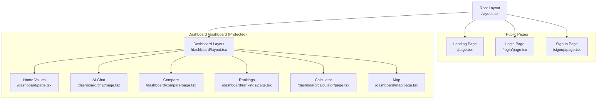

# Frontend

## Overview

The frontend is built with Next.js 16 using the App Router, React 19, TypeScript, and Tailwind CSS v4. Charts are rendered using Recharts 3, maps with react-simple-maps, and server state is managed with TanStack Query.

## Page Structure



## Landing Page

**File:** `src/app/page.tsx` (Server Component)

- Hero section with HousingIQ branding and value proposition
- 3 feature cards: Home Value Trends, Geographic Coverage, Compare Regions
- Blurred dashboard preview for non-authenticated users
- "Go to Dashboard" CTA for authenticated users
- Footer with Zillow data attribution

## Login Page

**File:** `src/app/login/page.tsx` (Client Component)

- Email/password login form
- Google OAuth sign-in button
- Test credentials hint (test@housingiq.com / TestPassword123!)
- Link to signup page

## Dashboard Layout

**File:** `src/app/dashboard/layout.tsx` (Server Component)

Authenticates session (redirects to `/login` if not authenticated). Provides:
- Fixed sidebar (desktop) with HousingIQ logo
- Mobile header
- User avatar, name, and email display
- Sign out button

### Navigation Items

| Icon | Label | Route |
|------|-------|-------|
| TrendingUp | Dashboard | /dashboard |
| MessageSquare | AI Chat | /dashboard/chat |
| BarChart3 | Compare | /dashboard/compare |
| Trophy | Rankings | /dashboard/rankings |
| Calculator | Calculator | /dashboard/calculator |
| Map | Map | /dashboard/map |

## Dashboard Home Page

**File:** `src/app/dashboard/page.tsx` (Client Component)

The main analytics dashboard with two states:

### No Region Selected (Default)
- Platform stats bar showing region counts (State/Metro/County/City) via TanStack Query
- Data freshness indicator (data through date, total regions)
- LocationSearchBar with geography type tabs
- Market Temperature distribution (Hot/Warm/Cold counts)
- Top Appreciating States (clickable cards)
- Cooling Markets (clickable cards)
- Best Rent Yield metros (clickable cards)

### Region Selected
- MarketOverviewCard (current home value, rent, price-to-rent ratio, market badge)
- Filter controls: home type, tier, time range
- PriceTrendChart (ZHVI line chart)
- MarketHealthScore (0-100 computed metric)
- BedroomComparisonChart (1-5+ bedroom breakdown)
- PropertyTypeAnalysis (Single Family vs Condo vs All Homes)
- ZHVI/ZORI data attribution card

## AI Chat Page

**File:** `src/app/dashboard/chat/page.tsx` (Client Component)

Multi-model AI chat for housing market questions.

**Features:**
- Model selector: GPT 5.2, Claude Haiku 4.5, Gemini 3 Flash, Claude 3.7 Sonnet (with reasoning)
- Streaming chat using Vercel AI SDK `useChat` hook
- Reasoning/thinking display (collapsible) for reasoning models
- ChatStats bar showing:
  - Session token usage (input/output/total formatted as "1.2k")
  - Rate limit progress bar with countdown timer
  - Warning when <=3 chats remaining
- ConversationEmptyState when no messages
- Submit/stop button with streaming spinner

## Compare Page

**File:** `src/app/dashboard/compare/page.tsx` (Client Component)

Multi-region comparison tool.

**Features:**
- RegionComparePicker: select up to 4 regions with color coding
- Filter controls: home type, tier, time range (1/3/5/10 years)
- Per-region stat cards: home value, rent, YoY%, price-to-rent ratio, market classification badge
- Overlay line chart using recharts/shadcn ChartContainer comparing ZHVI trends

## Rankings Page

**File:** `src/app/dashboard/rankings/page.tsx` (Client Component)

Sortable market rankings table.

**Features:**
- Geography filter: States / Metro Areas / Cities
- Sort by: Home Value YoY%, Rent YoY%, Rent Yield%, Price-to-Rent, Home Value
- Order toggle (high to low / low to high)
- Ranked table: rank, region name, home value, YoY%, rent, rent YoY%, yield%, market badge
- Row click navigates to `/dashboard?regionId=...`
- Note shown for state level (no rent data available)

## Calculator Page

**File:** `src/app/dashboard/calculator/page.tsx` (Client Component)

Real estate investment calculator with all client-side calculations via `useMemo`.

**Inputs:**
- Purchase price, down payment %, interest rate, loan term (15/20/30yr)
- Monthly rent, expense ratio %, appreciation rate, hold period

**Outputs:**
- Monthly cash flow, cap rate, cash-on-cash return, total ROI
- Projected equity growth area chart
- Investment summary table

## Map Page

**File:** `src/app/dashboard/map/page.tsx` (Client Component)

US state choropleth map with dynamic import (SSR disabled) of react-simple-maps.

**Features:**
- Metric toggle: Home Value YoY% (diverging red-yellow-green scale) or Home Value (sequential scale)
- ZoomableGroup with state geography rendered via FIPS codes
- State abbreviation labels with offsets for small NE states
- Hover tooltip: state name, market classification, home value, YoY/MoM%
- Market classification legend (Hot/Warm/Cold with criteria)
- Sortable state data table below map

## Components

### Domain Components

| Component | File | Description |
|-----------|------|-------------|
| **LocationSearchBar** | `LocationSearchBar.tsx` | Typeahead search with geography type tabs (State/Metro/County/City/ZIP). ZIP tab locked with "PRO" badge. Debounced search (300ms) via `/api/regions/search`. Popular regions shown on focus. |
| **MarketOverviewCard** | `MarketOverviewCard.tsx` | Summary card: current home price, rent, price-to-rent ratio. Market classification badge (Hot/Warm/Cold). Hides rent metrics when unavailable. |
| **PriceTrendChart** | `PriceTrendChart.tsx` | Single-line Recharts LineChart for ZHVI. Custom tooltip with home value and MoM change. Y-axis in $k notation. |
| **MarketHealthScore** | `MarketHealthScore.tsx` | Computed 0-100 score from 4 metrics (25pts each): Appreciation (3-8% YoY), Rent Growth (2-6%), P/R Ratio (<15), Rent Yield (>8%). Labels: Excellent/Good/Fair/Weak/Poor. |
| **BedroomComparisonChart** | `BedroomComparisonChart.tsx` | Multi-line chart comparing ZHVI by bedroom count (1-5+). Stat cards per bedroom with YoY% trend. Insights for best/slowest performers. |
| **PropertyTypeAnalysis** | `PropertyTypeAnalysis.tsx` | Multi-line chart comparing Single Family vs Condo vs All Homes. SFR premium/discount banner. Investment insights. |
| **RegionComparePicker** | `RegionComparePicker.tsx` | Multi-region selector for compare page. Up to 4 regions with assigned colors. |
| **Providers** | `Providers.tsx` | Client-side provider wrapper (TanStack Query QueryClient). |

### AI Elements (`src/components/ai-elements/`)

A library of AI chat UI primitives (adapted from Vercel AI Chatbot reference app):

| Component | Description |
|-----------|-------------|
| `chat-stats.tsx` | Rate limit + token usage stats bar. Fetches `/api/chat/usage`, shows progress bar and countdown timer. |
| `conversation.tsx` | Conversation container with scroll-to-bottom behavior |
| `message.tsx` | Message bubbles (user/assistant) with content rendering |
| `prompt-input.tsx` | Input textarea with model selector dropdown and submit/stop button |
| `reasoning.tsx` | Collapsible reasoning/thinking content display |
| `code-block.tsx` | Syntax-highlighted code blocks with Shiki |
| `chain-of-thought.tsx` | Chain of thought visualization |

### UI Components (`src/components/ui/`)

Full shadcn/ui library including: accordion, alert, avatar, badge, button, button-group, card, carousel, chart (ChartContainer/ChartTooltip/ChartLegend), collapsible, command, dialog, dropdown-menu, hover-card, input, input-group, label, popover, progress, scroll-area, select, separator, skeleton, slider, spinner, switch, tabs, textarea, tooltip.

## TanStack Query Hooks

**File:** `src/lib/hooks/use-market.ts`

| Hook | Endpoint | Description |
|------|----------|-------------|
| `useMarketStats()` | `/api/market/stats` | Platform stats (region counts, data freshness, market health) |
| `useMarketData(regionId)` | `/api/market/{regionId}` | Single market summary |
| `useTrendData(regionId, opts)` | `/api/market/{regionId}/trends` | ZHVI time series with filters |
| `useRankings(opts)` | `/api/market/rankings` | Sorted market rankings |

## Styling

### Tailwind CSS v4

**File:** `src/app/globals.css`

```css
@import "tailwindcss";

@theme {
  --font-sans: var(--font-inter), ui-sans-serif, system-ui, sans-serif;
}
```

### Icons

Using Lucide React for consistent iconography:

```typescript
import {
  Home, TrendingUp, TrendingDown, BarChart3, MapPin,
  Calendar, ArrowRight, LogOut, MessageSquare, Trophy,
  Calculator, Map, Search, X,
} from 'lucide-react';
```

## Key Patterns

### Server vs Client Components

- **Server Components** (default): Layouts, landing page, initial data fetching
- **Client Components** (`'use client'`): Dashboard pages, charts, search, AI chat, calculator

### Data Fetching

- **TanStack Query**: Used for market stats, market data, trends, rankings (with caching and refetch)
- **Vercel AI SDK `useChat`**: Used for AI chat streaming
- **Direct fetch**: Used in search bar for typeahead results

### Dynamic Imports

- `react-simple-maps` is dynamically imported with `ssr: false` on the map page to avoid SSR issues with D3
