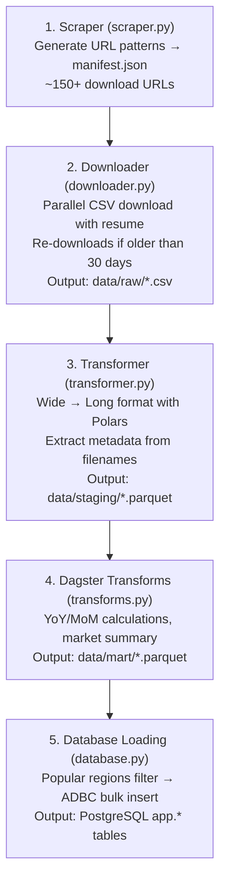

# Zillow Data Source

## Overview

The Zillow data source is the primary data source for HousingIQ. It provides housing market data through Zillow Research's publicly available CSV files.

**Location:** `data-platform/ingestion/sources/zillow/`

## Data Categories

| Category | Description | Update Frequency | Used in App |
|----------|-------------|------------------|-------------|
| **zhvi** | Zillow Home Value Index | Monthly | Yes |
| **zori** | Zillow Observed Rent Index | Monthly | Yes |
| **invt_fs** | For-Sale Inventory | Weekly/Monthly | Parquet only |
| **market_temp_index** | Market Heat Index | Monthly | Parquet only |
| **mortgage_payment** | Mortgage Payment Estimates | Monthly | Parquet only |
| **new_homeowner_income_needed** | Income Required (Homeowner) | Monthly | Parquet only |
| **new_renter_income_needed** | Income Required (Renter) | Monthly | Parquet only |

## Pipeline Architecture



## Components

### 1. scraper.py - URL Generator

Generates all possible download URLs from Zillow Research based on known URL patterns.

**Features:**
- Covers 35+ data patterns across multiple categories
- Supports all geography levels (Metro, State, County, City, Zip, Neighborhood)
- Generates manifest for incremental updates

**Dagster Asset:** `zillow_manifest`

**Output:** `manifest.json` with ~150+ download URLs

### 2. downloader.py - Parallel Downloader

Downloads CSV files with parallel execution and resume capability.

**Features:**
- Parallel downloads (configurable workers)
- Skip files newer than 30 days (re-download older files)
- Category filtering
- Progress tracking
- Rate limiting to avoid blocks

**Dagster Asset:** `zillow_raw_files`

**Output:** `data/raw/{category}/*.csv`

### 3. transformer.py - CSV to Parquet

Transforms Zillow CSV data from wide format to long format using Polars.

**Features:**
- High-performance processing with Polars (20-50x faster than pandas)
- Schema normalization across different files
- Region extraction to separate dimension table
- Metadata extraction from filenames (geography level, home type, tier, bedrooms, smoothed, seasonally adjusted)
- Parquet output with Snappy compression

**Dagster Assets:** `zillow_zhvi_transformed`, `zillow_zori_transformed`

**Input Format (Wide):**
```
RegionID | RegionName | State | 2023-01 | 2023-02 | 2023-03 | ...
12345    | Austin     | TX    | 450000  | 455000  | 460000  | ...
```

**Output Format (Long):**
```
region_id | date       | value  | geography_level | home_type | tier     | ...
12345     | 2023-01-01 | 450000 | Metro           | All Homes | Mid-Tier | ...
12345     | 2023-02-01 | 455000 | Metro           | All Homes | Mid-Tier | ...
```

### 4. config.py - Configuration

URL patterns, download categories, and settings for the Zillow scraper and downloader.

### 5. schemas.py - Pydantic Models

Data validation models for Zillow data structures.

## Data Schema

### Regions (Dimension)

| Column | Type | Description |
|--------|------|-------------|
| `region_id` | String | Unique region identifier (e.g., `state_ca`, `metro_10580`) |
| `region_name` | String | Region name |
| `display_name` | String | Formatted display name for UI |
| `state` | String | State abbreviation (2 chars) |
| `state_name` | String | Full state name |
| `city` | String | City name |
| `metro` | String | Metro area |
| `county` | String | County name |
| `geography_level` | String | Geography level |
| `size_rank` | Integer | Population-based ranking |

### Values (Fact)

| Column | Type | Description |
|--------|------|-------------|
| `region_id` | String | Foreign key to regions |
| `date` | Date | Observation date |
| `value` | Float | Index value (home price or rent in USD) |
| `geography_level` | String | Geography level |
| `home_type` | String | All Homes/Single Family/Condo/Multi Family |
| `tier` | String | Mid-Tier/Top-Tier/Bottom-Tier |
| `bedrooms` | Integer | Bedroom count (1-5, nullable) |
| `smoothed` | Boolean | Smoothed indicator |
| `seasonally_adjusted` | Boolean | SA indicator |
| `frequency` | String | Data frequency (monthly) |
| `mom_change_pct` | Float | Month-over-month change % (added by transforms) |
| `yoy_change_pct` | Float | Year-over-year change % (added by transforms) |

## Running the Pipeline

The Zillow pipeline is fully integrated with Dagster. Run it via:

```bash
# From the repo root
make materialize

# Or start Dagster UI and materialize manually
make dagster  # Opens http://localhost:3001
```

The pipeline runs in order:
1. `zillow_manifest` - Generate URL manifest
2. `zillow_raw_files` - Download CSVs
3. `zillow_zhvi_transformed` / `zillow_zori_transformed` - Parse to Parquet
4. `dim_regions`, `fct_zhvi_values`, `fct_zori_values` - Transform
5. `market_summary` - Aggregate
6. `app_regions`, `app_zhvi_values`, `app_market_summary` - Load to PostgreSQL

## Performance

| Operation | Time | Notes |
|-----------|------|-------|
| URL Generation | ~1 sec | 150+ URLs |
| Download (5 workers) | ~2-5 min | Depends on network |
| Transformation | ~30-60 sec | 50+ files, millions of rows |
| Database Load | ~5-10 sec | ADBC bulk insert |

## Data Volume

| Geography Level | Approximate Regions |
|-----------------|---------------------|
| National | 1 |
| State | 51 |
| Metro | ~900 |
| County | ~3,000 |
| City | ~30,000 |
| Zip | ~25,000 |

With monthly data from 2000-present, the full dataset can exceed **100 million rows**. The popular regions filter reduces this to ~1.5M rows for the app database.

## Notes

- Zillow Research Data is updated monthly (typically around the 15th)
- Some geography/indicator combinations may not exist (404 errors are expected and handled)
- Large files (Zip-level) may take longer to process
- Parquet format provides ~5-10x compression vs CSV
- Data subject to [Zillow's Terms of Use](https://www.zillow.com/z/corp/terms/)
