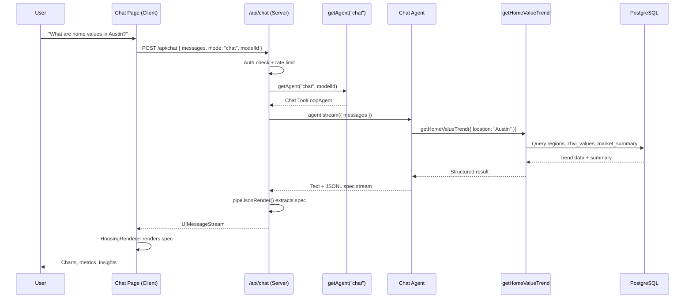
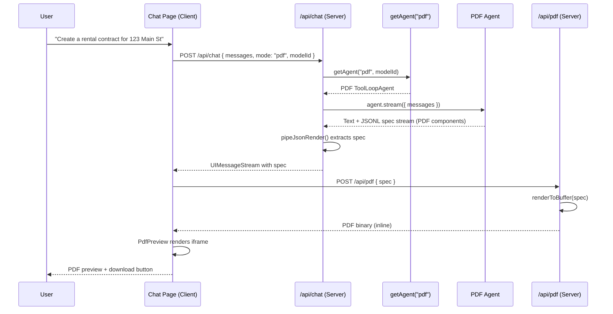
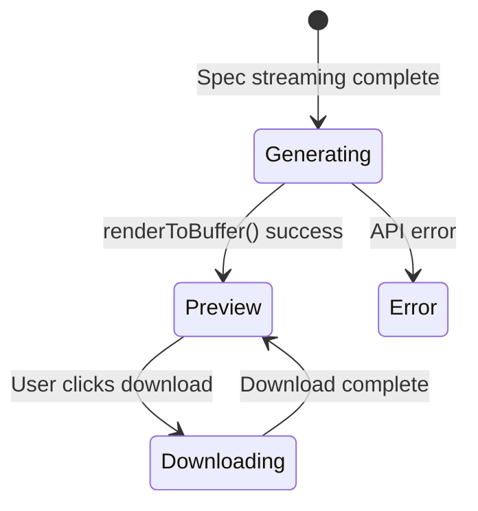

# AI Chat & Generative UI

## Overview

HousingIQ includes an AI-powered chat interface that operates in two modes: **Chat** for interactive housing market analytics, and **PDF** for generating downloadable documents like rental contracts and property reports. The system combines a **multi-mode ToolLoopAgent** (from the Vercel AI SDK) for autonomous reasoning with **json-renderer** for generative UI — the AI dynamically generates React component trees as JSONL specs that render charts, metrics, and insights in real time (chat mode) or server-rendered PDF documents (PDF mode). Users can switch between modes and select from multiple AI models directly in the UI.

## Architecture

### Chat Mode



### PDF Mode



## Multi-Mode Agent

The system uses a `getAgent()` factory function that returns a mode-specific **ToolLoopAgent**. Each mode has its own instructions, tool set, and component catalog.

**File:** `src/lib/ai/agent.ts`

```typescript
export type ChatMode = "chat" | "pdf";

export function getAgent(mode: ChatMode, modelId?: string) {
  const model = getLanguageModel(modelId);
  const providerOptions = getProviderOptions(modelId ?? DEFAULT_MODEL);

  if (mode === "pdf") {
    return new ToolLoopAgent({
      model,
      instructions: PDF_AGENT_INSTRUCTIONS,
      tools: {},
      stopWhen: stepCountIs(1),
      temperature: 0.5,
      providerOptions,
    });
  }

  return new ToolLoopAgent({
    model,
    instructions: AGENT_INSTRUCTIONS,
    tools: { getHomeValueTrend },
    stopWhen: stepCountIs(3),
    temperature: 0.5,
    providerOptions,
  });
}
```

### Mode Comparison

| | Chat Mode | PDF Mode |
|---|---|---|
| **Instructions** | `AGENT_INSTRUCTIONS` (housing analytics) | `PDF_AGENT_INSTRUCTIONS` (document generation) |
| **Tools** | `getHomeValueTrend` | None |
| **Max steps** | 3 | 1 |
| **Catalog** | `housingCatalog` (shadcn/ui + Recharts) | `pdfCatalog` (react-pdf) |
| **Output** | Interactive dashboard components | PDF document components |

### Chat Agent Workflow

1. **Analyze** — Reads user query, determines if a tool call is needed
2. **Tool call** — Invokes `getHomeValueTrend` with the extracted location
3. **Respond** — Writes 2-3 sentence summary + JSONL UI spec with data bindings

**Key behaviors:**
- Runs up to 3 reasoning steps per turn (tool calls count as steps)
- Calls tools first to fetch real data, then generates a response
- Outputs a brief conversational summary followed by a ````spec` fenced JSONL block
- Embeds tool results into `/state` patches so UI components can bind to live data

### PDF Agent Workflow

1. **Analyze** — Reads the user's document request (e.g., "rental contract for 123 Main St")
2. **Respond** — Generates the full document as a JSONL spec using PDF components (Document, Page, Heading, Text, Table, etc.)

**Key behaviors:**
- Single-step execution (no tool calls)
- Produces professional, ready-to-render document content
- Uses `Document > Page` wrapper structure with proper margins
- Generates realistic placeholder content where the user doesn't specify details

## Generative UI (json-renderer)

The generative UI system uses `@json-render/*` packages to let the AI produce React component trees at runtime. Chat mode renders interactive web components; PDF mode renders server-side documents.

| Package | Purpose |
|---------|---------|
| `@json-render/core` | Spec parsing, state management, `pipeJsonRender()` stream transform |
| `@json-render/react` | React renderer, `StateProvider`, `Renderer` component |
| `@json-render/shadcn` | Pre-built shadcn/ui component definitions (Stack, Card, Grid, etc.) |
| `@json-render/react-pdf` | Server-side PDF rendering, PDF component catalog, `renderToBuffer()` |

### How It Works

1. The AI emits JSONL (newline-delimited JSON) inside a ````spec` fence
2. Each line is either a **state patch** (`{"op":"add","path":"/state/trend","value":[...]}`) or a **component node** (`{"type":"Metric","props":{...}}`)
3. `pipeJsonRender()` in the API route extracts the spec from the stream
4. The client's `HousingRenderer` feeds the spec into the `Renderer` component
5. The registry maps each `type` to a real React component

### Example JSONL Spec

```jsonl
{"op":"add","path":"/state/trend","value":[{"date":"2024-01","homeValue":350000},{"date":"2024-02","homeValue":352000}]}
{"type":"Card","props":{}}
{"type":"Heading","props":{"level":3,"text":"Austin, TX - Home Value Trend"}}
{"type":"Grid","props":{"columns":"3"}}
{"type":"Metric","props":{"label":"Current Value","value":"$352,000","detail":"Mid-Tier All Homes","trend":"up"}}
{"type":"Metric","props":{"label":"YoY Change","value":"+5.2%","detail":"Year over year","trend":"up"}}
{"type":"Metric","props":{"label":"MoM Change","value":"+0.3%","detail":"Month over month","trend":"up"}}
{"type":"/Grid"}
{"type":"LineChart","props":{"title":"Home Value (ZHVI) - Last 24 Months","data":{"$state":"/trend"},"xKey":"date","yKey":"homeValue","color":"#2563eb","height":300}}
{"type":"Callout","props":{"type":"tip","title":"Market Insight","content":"Home values have been steadily appreciating..."}}
{"type":"/Card"}
```

This renders a Card containing a 3-column metric grid, a line chart bound to state data, and an insight callout — all streamed incrementally as tokens arrive.

### State Binding

Data flows through a JSON Pointer-based state model:

- **State patches** (`{"op":"add","path":"/state/trend","value":[...]}`) set data in the state store
- **Component props** reference state with `{"$state": "/trend"}` — resolved at render time
- State patches must appear **before** the components that reference them

## Component Catalogs

### Chat Catalog (Interactive UI)

**File:** `src/lib/ai/render/catalog.ts`

#### Built-in shadcn Components

| Component | Description |
|-----------|-------------|
| `Stack` | Flexbox container for vertical/horizontal layouts |
| `Card` | Content wrapper with border and padding |
| `Grid` | Multi-column grid layout |
| `Heading` | Text headers (h1–h6) |
| `Separator` | Visual divider |
| `Badge` | Status label |

#### Custom Housing Components

| Component | Props | Description |
|-----------|-------|-------------|
| `Text` | `content`, `muted?` | Paragraph text |
| `Metric` | `label`, `value`, `detail?`, `trend?` | Key numeric value with trend indicator (up/down/neutral) |
| `LineChart` | `title?`, `data`, `xKey`, `yKey`, `color?`, `height?` | Recharts-powered time-series chart with currency formatting |
| `Callout` | `type?`, `title?`, `content` | Highlighted insight box (info, tip, warning, important) |

#### Component Registry

**File:** `src/lib/ai/render/registry.tsx`

Maps catalog entries to React implementations. Custom components like `Metric` and `LineChart` are implemented inline, while shadcn components delegate to `@json-render/shadcn`.

#### Renderer

**File:** `src/lib/ai/render/renderer.tsx`

```typescript
export function HousingRenderer({ spec, loading }: HousingRendererProps) {
  return (
    <StateProvider initialState={spec.state ?? {}}>
      <VisibilityProvider>
        <ActionProvider>
          <Renderer spec={spec} registry={registry} fallback={fallback} loading={loading} />
        </ActionProvider>
      </VisibilityProvider>
    </StateProvider>
  );
}
```

### PDF Catalog (Document Generation)

**File:** `src/lib/ai/pdf-catalog.ts`

Uses `@json-render/react-pdf` standard component definitions for server-side PDF rendering.

```typescript
import { defineCatalog } from "@json-render/core";
import { schema } from "@json-render/react-pdf/server";
import { standardComponentDefinitions } from "@json-render/react-pdf/catalog";

export const pdfCatalog = defineCatalog(schema, {
  components: standardComponentDefinitions,
  actions: {},
});
```

#### PDF Components

| Component | Props | Description |
|-----------|-------|-------------|
| `Document` | `title?` | Root document wrapper |
| `Page` | `size?`, `marginTop?`, `marginBottom?`, `marginLeft?`, `marginRight?` | Page container (default: LETTER, 50pt margins) |
| `Heading` | `text`, `level`, `align?` | Section headers (h1–h3) |
| `Text` | `text` | Body paragraphs and clauses |
| `Table` | (structured data) | Payment schedules, property details |
| `List` | `ordered?` | Terms, conditions, enumerated items |
| `Divider` | `marginTop?`, `marginBottom?` | Section separator |
| `Row` / `Column` | — | Side-by-side layouts |
| `Spacer` | `height` | Vertical spacing |

#### Example PDF Spec

```jsonl
{"type":"Document","props":{"title":"Rental Agreement"}}
{"type":"Page","props":{"size":"LETTER","marginTop":50,"marginBottom":50,"marginLeft":50,"marginRight":50}}
{"type":"Heading","props":{"text":"RESIDENTIAL LEASE AGREEMENT","level":"h1","align":"center"}}
{"type":"Spacer","props":{"height":20}}
{"type":"Text","props":{"text":"This agreement is entered into on..."}}
{"type":"Divider","props":{"marginTop":15,"marginBottom":15}}
{"type":"Heading","props":{"text":"1. PROPERTY","level":"h2"}}
{"type":"Text","props":{"text":"The Landlord agrees to lease the property located at..."}}
{"type":"/Page"}
{"type":"/Document"}
```

## Tools

### getHomeValueTrend

**File:** `src/lib/ai/tools/home-value-trend.ts`

Fetches ZHVI (Zillow Home Value Index) trend data and market summary for a location.

**Input:**
- `location` (string) — City, state, metro area, or zip code (e.g., "Austin, TX", "California", "90210")

**Output:**
```typescript
{
  region: {
    regionId: string;
    name: string;
    geographyLevel: string;  // National | State | Metro | County | City | Zip
    state: string;
  };
  trend: Array<{
    date: string;
    homeValue: number;
    momChangePct: number | null;
    yoyChangePct: number | null;
  }>;
  summary: {
    currentHomeValue: number;
    homeValueYoyPct: number | null;
    homeValueMomPct: number | null;
    currentRentValue: number | null;
    rentYoyPct: number | null;
    priceToRentRatio: number | null;
    grossRentYieldPct: number | null;
    marketClassification: string | null;
  } | null;
}
```

**Database queries:**
- Searches `app.regions` via flexible ILIKE matching on name, display name, state, and metro
- Fetches 24 months of `app.zhvi_values` (All Homes, Mid-Tier, Smoothed, Seasonally Adjusted)
- Retrieves pre-aggregated `app.market_summary`

## API Routes

### Chat API

**File:** `src/app/api/chat/route.ts`

```
POST /api/chat
```

**Request body:**
```typescript
{
  messages: UIMessage[];
  mode?: ChatMode;    // "chat" (default) | "pdf"
  modelId?: string;   // e.g. "openai/gpt-5.2"
}
```

**Flow:**
1. Authenticate via NextAuth.js session
2. Rate limit check (Upstash Redis — 20 requests/hour per user)
3. Call `getAgent(mode, modelId)` to obtain the mode-specific agent
4. Convert UI messages to model format
5. Stream agent response through `pipeJsonRender()` to extract specs
6. Return `UIMessageStream` with rate limit headers

**Rate limit headers:** `X-RateLimit-Remaining`, `X-RateLimit-Reset`, `Retry-After` (on 429)

### PDF API

**File:** `src/app/api/pdf/route.ts`

```
POST /api/pdf
```

Server-side PDF rendering endpoint. Takes a JSONL spec (produced by the PDF agent) and returns a rendered PDF binary.

**Request body:**
```typescript
{
  spec: Spec;           // JSONL component spec from the PDF agent
  download?: boolean;   // false = inline preview, true = attachment download
  filename?: string;    // Default: "document.pdf"
}
```

**Response:** PDF binary with `Content-Type: application/pdf` and appropriate `Content-Disposition` header.

**Flow:**
1. Authenticate via NextAuth.js session
2. Validate spec is present
3. Render spec to PDF buffer via `renderToBuffer()` from `@json-render/react-pdf/render`
4. Return PDF with inline or attachment disposition

## Multi-Model Support

**File:** `src/lib/ai/providers.ts`

Users select a model from the prompt bar dropdown. The selected `modelId` is sent with each request and passed to `getAgent()`, which calls `getLanguageModel(modelId)` to instantiate the correct provider. Both chat and PDF modes support all models.

| Model ID | Label | Notes |
|----------|-------|-------|
| `openai/gpt-5.2` | GPT 5.2 | Default |
| `anthropic/claude-haiku-4.5` | Claude Haiku 4.5 | |
| `google/gemini-3-flash` | Gemini 3 Flash | |
| `anthropic/claude-3.7-sonnet-thinking` | Claude 3.7 Sonnet | Extended thinking (5,000 budget tokens) |

The `getLanguageModel()` function handles reasoning-model wrapping (extracting `<thinking>` tags via middleware), while `getProviderOptions()` returns provider-specific options (Anthropic thinking budget, Google thinking config, OpenAI reasoning summary).

## Client-Side Integration

**File:** `src/app/dashboard/chat/page.tsx`

The chat page uses the Vercel AI SDK's `useChat()` hook with `DefaultChatTransport`. It manages two key pieces of UI state — `chatMode` and `selectedModel` — which are sent to the API on every request.

### Mode & Model Selection

```typescript
const [chatMode, setChatMode] = useState<ChatMode>("chat");
const [selectedModel, setSelectedModel] = useState<string>(DEFAULT_MODEL);
```

- **Mode selector** — An action menu in the prompt bar lets users switch between "Housing Data" (chat) and "Create PDF" (pdf) modes. An active PDF mode badge appears above the input.
- **Model selector** — A dropdown (`PromptInputSelect`) in the prompt bar lets users choose from `AVAILABLE_MODELS` defined in `providers.ts`.

Both values are passed in the transport body to `/api/chat`.

### Message Rendering Pipeline

1. User submits a message via `PromptInput`
2. `useChat()` streams the response from `/api/chat`
3. `useJsonRenderMessage()` extracts the spec from message parts
4. Message parts are rendered based on type:
   - **Reasoning** — Collapsible accordion (for thinking models)
   - **Text** — Markdown via Streamdown renderer
   - **Tool calls** — Loading states with tool name/arguments
   - **Spec (chat mode)** — `HousingRenderer` renders the interactive generative UI
   - **Spec (PDF mode)** — `PdfPreview` component renders an inline PDF preview

### PDF Preview Component

When in PDF mode, once the agent finishes streaming and the spec is complete, the `PdfPreview` component:

1. Sends the spec to `POST /api/pdf` to generate the PDF
2. Displays the rendered PDF in an `<iframe>` for inline preview
3. Shows a download button that re-requests the PDF with `download: true` and triggers a browser download



## Key Files

| File | Purpose |
|------|---------|
| `src/lib/ai/agent.ts` | `getAgent()` factory, `ChatMode` type, chat + PDF agent instructions |
| `src/app/api/chat/route.ts` | Chat API endpoint (accepts mode + modelId) |
| `src/app/api/pdf/route.ts` | PDF rendering endpoint (spec → PDF binary) |
| `src/app/dashboard/chat/page.tsx` | Chat page UI (mode selector, model selector, PDF preview) |
| `src/lib/ai/render/catalog.ts` | Chat component definitions (Zod schemas) |
| `src/lib/ai/render/registry.tsx` | Chat component implementations (React) |
| `src/lib/ai/render/renderer.tsx` | HousingRenderer wrapper |
| `src/lib/ai/pdf-catalog.ts` | PDF component catalog (`@json-render/react-pdf`) |
| `src/lib/ai/tools/home-value-trend.ts` | Home value trend tool (chat mode only) |
| `src/lib/ai/providers.ts` | AI model configuration + `getLanguageModel()` |
| `src/lib/ai/ratelimit.ts` | Rate limiting (Upstash Redis) |

## Dependencies

```json
{
  "ai": "^6.0.94",
  "@ai-sdk/gateway": "^3.0.52",
  "@ai-sdk/react": "^3.0.96",
  "@json-render/core": "^0.8.0",
  "@json-render/react": "^0.8.0",
  "@json-render/shadcn": "^0.8.0",
  "@json-render/react-pdf": "^0.8.0",
  "recharts": "^3.6.0",
  "@upstash/ratelimit": "^2.0.8",
  "@upstash/redis": "^1.36.2"
}
```
