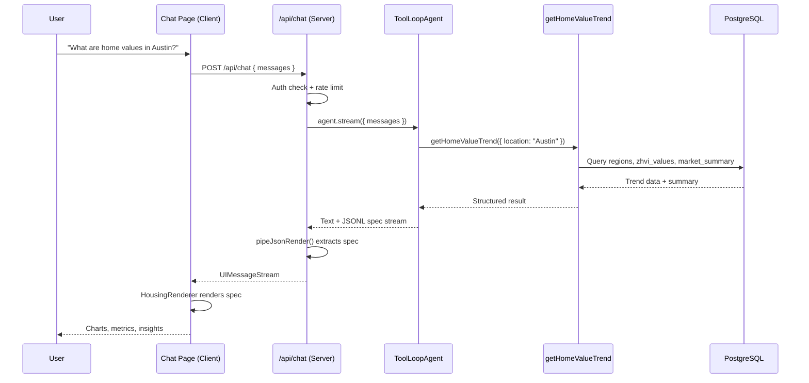

# AI Chat & Generative UI

## Overview

HousingIQ includes an AI-powered chat interface that lets users ask natural-language questions about housing markets and receive rich, interactive visual responses. The system combines a **ToolLoopAgent** (from the Vercel AI SDK) for autonomous multi-step reasoning with **json-renderer** for generative UI — the AI dynamically generates React component trees as JSONL specs that render charts, metrics, and insights in real time.

## Architecture



## ToolLoopAgent

The agent is the core orchestrator. It receives user messages, decides when to call tools, and generates both conversational text and structured UI specs.

**File:** `src/lib/ai/agent.ts`

```typescript
import { ToolLoopAgent, stepCountIs } from "ai";
import { gateway } from "@ai-sdk/gateway";

export const agent = new ToolLoopAgent({
  model: gateway(process.env.AI_GATEWAY_MODEL || "anthropic/claude-haiku-4.5"),
  instructions: AGENT_INSTRUCTIONS,
  tools: { getHomeValueTrend },
  stopWhen: stepCountIs(3),
  temperature: 0.5,
});
```

**Key behaviors:**
- Runs up to 3 reasoning steps per turn (tool calls count as steps)
- Calls tools first to fetch real data, then generates a response
- Outputs a brief conversational summary followed by a ````spec` fenced JSONL block
- Embeds tool results into `/state` patches so UI components can bind to live data

### Agent Workflow

1. **Analyze** — Reads user query, determines if a tool call is needed
2. **Tool call** — Invokes `getHomeValueTrend` with the extracted location
3. **Respond** — Writes 2-3 sentence summary + JSONL UI spec with data bindings

## Generative UI (json-renderer)

The generative UI system uses three `@json-render/*` packages to let the AI produce React component trees at runtime:

| Package | Purpose |
|---------|---------|
| `@json-render/core` | Spec parsing, state management, `pipeJsonRender()` stream transform |
| `@json-render/react` | React renderer, `StateProvider`, `Renderer` component |
| `@json-render/shadcn` | Pre-built shadcn/ui component definitions (Stack, Card, Grid, etc.) |

### How It Works

1. The AI emits JSONL (newline-delimited JSON) inside a ````spec` fence
2. Each line is either a **state patch** (`{"op":"add","path":"/state/trend","value":[...]}`) or a **component node** (`{"type":"Metric","props":{...}}`)
3. `pipeJsonRender()` in the API route extracts the spec from the stream
4. The client's `HousingRenderer` feeds the spec into the `Renderer` component
5. The registry maps each `type` to a real React component

### Example JSONL Spec

```jsonl
{"op":"add","path":"/state/trend","value":[{"date":"2024-01","homeValue":350000},{"date":"2024-02","homeValue":352000}]}
{"type":"Card","props":{}}
{"type":"Heading","props":{"level":3,"text":"Austin, TX - Home Value Trend"}}
{"type":"Grid","props":{"columns":"3"}}
{"type":"Metric","props":{"label":"Current Value","value":"$352,000","detail":"Mid-Tier All Homes","trend":"up"}}
{"type":"Metric","props":{"label":"YoY Change","value":"+5.2%","detail":"Year over year","trend":"up"}}
{"type":"Metric","props":{"label":"MoM Change","value":"+0.3%","detail":"Month over month","trend":"up"}}
{"type":"/Grid"}
{"type":"LineChart","props":{"title":"Home Value (ZHVI) - Last 24 Months","data":{"$state":"/trend"},"xKey":"date","yKey":"homeValue","color":"#2563eb","height":300}}
{"type":"Callout","props":{"type":"tip","title":"Market Insight","content":"Home values have been steadily appreciating..."}}
{"type":"/Card"}
```

This renders a Card containing a 3-column metric grid, a line chart bound to state data, and an insight callout — all streamed incrementally as tokens arrive.

### State Binding

Data flows through a JSON Pointer-based state model:

- **State patches** (`{"op":"add","path":"/state/trend","value":[...]}`) set data in the state store
- **Component props** reference state with `{"$state": "/trend"}` — resolved at render time
- State patches must appear **before** the components that reference them

## Component Catalog

**File:** `src/lib/ai/render/catalog.ts`

### Built-in shadcn Components

| Component | Description |
|-----------|-------------|
| `Stack` | Flexbox container for vertical/horizontal layouts |
| `Card` | Content wrapper with border and padding |
| `Grid` | Multi-column grid layout |
| `Heading` | Text headers (h1–h6) |
| `Separator` | Visual divider |
| `Badge` | Status label |

### Custom Housing Components

| Component | Props | Description |
|-----------|-------|-------------|
| `Text` | `content`, `muted?` | Paragraph text |
| `Metric` | `label`, `value`, `detail?`, `trend?` | Key numeric value with trend indicator (up/down/neutral) |
| `LineChart` | `title?`, `data`, `xKey`, `yKey`, `color?`, `height?` | Recharts-powered time-series chart with currency formatting |
| `Callout` | `type?`, `title?`, `content` | Highlighted insight box (info, tip, warning, important) |

### Component Registry

**File:** `src/lib/ai/render/registry.tsx`

Maps catalog entries to React implementations. Custom components like `Metric` and `LineChart` are implemented inline, while shadcn components delegate to `@json-render/shadcn`.

### Renderer

**File:** `src/lib/ai/render/renderer.tsx`

```typescript
export function HousingRenderer({ spec, loading }: HousingRendererProps) {
  return (
    <StateProvider initialState={spec.state ?? {}}>
      <VisibilityProvider>
        <ActionProvider>
          <Renderer spec={spec} registry={registry} fallback={fallback} loading={loading} />
        </ActionProvider>
      </VisibilityProvider>
    </StateProvider>
  );
}
```

## Tools

### getHomeValueTrend

**File:** `src/lib/ai/tools/home-value-trend.ts`

Fetches ZHVI (Zillow Home Value Index) trend data and market summary for a location.

**Input:**
- `location` (string) — City, state, metro area, or zip code (e.g., "Austin, TX", "California", "90210")

**Output:**
```typescript
{
  region: {
    regionId: string;
    name: string;
    geographyLevel: string;  // National | State | Metro | County | City | Zip
    state: string;
  };
  trend: Array<{
    date: string;
    homeValue: number;
    momChangePct: number | null;
    yoyChangePct: number | null;
  }>;
  summary: {
    currentHomeValue: number;
    homeValueYoyPct: number | null;
    homeValueMomPct: number | null;
    currentRentValue: number | null;
    rentYoyPct: number | null;
    priceToRentRatio: number | null;
    grossRentYieldPct: number | null;
    marketClassification: string | null;
  } | null;
}
```

**Database queries:**
- Searches `app.regions` via flexible ILIKE matching on name, display name, state, and metro
- Fetches 24 months of `app.zhvi_values` (All Homes, Mid-Tier, Smoothed, Seasonally Adjusted)
- Retrieves pre-aggregated `app.market_summary`

## Chat API Route

**File:** `src/app/api/chat/route.ts`

```
POST /api/chat
```

**Request body:** `{ messages: UIMessage[] }`

**Flow:**
1. Authenticate via NextAuth.js session
2. Rate limit check (Upstash Redis — 20 requests/hour per user)
3. Convert UI messages to model format
4. Stream agent response through `pipeJsonRender()` to extract specs
5. Return `UIMessageStream` with rate limit headers

**Rate limit headers:** `X-RateLimit-Remaining`, `X-RateLimit-Reset`, `Retry-After` (on 429)

## Multi-Model Support

**File:** `src/lib/ai/providers.ts`

The chat supports multiple AI models via `@ai-sdk/gateway`:

| Model ID | Label | Notes |
|----------|-------|-------|
| `openai/gpt-5.2` | GPT 5.2 | Default |
| `anthropic/claude-haiku-4.5` | Claude Haiku 4.5 | Agent default |
| `google/gemini-3-flash` | Gemini 3 Flash | |
| `anthropic/claude-3.7-sonnet-thinking` | Claude 3.7 Sonnet | Extended thinking (5,000 budget tokens) |

## Client-Side Integration

**File:** `src/app/dashboard/chat/page.tsx`

The chat page uses the Vercel AI SDK's `useChat()` hook with `DefaultChatTransport`:

1. User submits a message via `PromptInput`
2. `useChat()` streams the response from `/api/chat`
3. `useJsonRenderMessage()` extracts the spec from message parts
4. Message rendering pipeline:
   - **Reasoning** — Collapsible accordion (for thinking models)
   - **Text** — Markdown via Streamdown renderer
   - **Tool calls** — Loading states with tool name/arguments
   - **Spec** — `HousingRenderer` renders the generative UI

## Key Files

| File | Purpose |
|------|---------|
| `src/lib/ai/agent.ts` | ToolLoopAgent configuration and instructions |
| `src/app/api/chat/route.ts` | Chat API endpoint |
| `src/app/dashboard/chat/page.tsx` | Chat page UI |
| `src/lib/ai/render/catalog.ts` | Component definitions (Zod schemas) |
| `src/lib/ai/render/registry.tsx` | Component implementations (React) |
| `src/lib/ai/render/renderer.tsx` | HousingRenderer wrapper |
| `src/lib/ai/tools/home-value-trend.ts` | Home value trend tool |
| `src/lib/ai/providers.ts` | AI model configuration |
| `src/lib/ai/ratelimit.ts` | Rate limiting (Upstash Redis) |

## Dependencies

```json
{
  "ai": "^6.0.94",
  "@ai-sdk/gateway": "^3.0.52",
  "@ai-sdk/react": "^3.0.96",
  "@json-render/core": "^0.8.0",
  "@json-render/react": "^0.8.0",
  "@json-render/shadcn": "^0.8.0",
  "recharts": "^3.6.0",
  "@upstash/ratelimit": "^2.0.8",
  "@upstash/redis": "^1.36.2"
}
```
